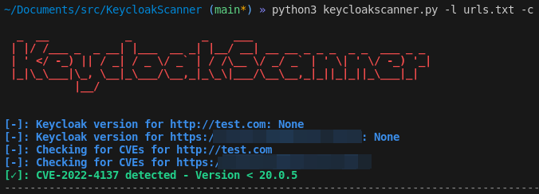

<h1 align="center">
     
        🔑🛡️ KeycloakScanner - Keycloak Security Scanner
     
     
</h1>

KeycloakScanner is a simple Python script designed to scan for version and security vulnerabilities in Keycloak.

## Description 📝

KeycloakScanner is a tool that helps identify version and security vulnerabilities in Keycloak, an open-source identity and access management solution. It automates the process of scanning for common security issues, making it easier to test and secure Keycloak installations.

## Features ⚙️

- Automated scanning for security vulnerabilities in Keycloak
- Easy to use with a simple command-line interface
- Identify common security issues and provide recommendations for mitigation

## Usage 🚀

1. Clone the repository:
